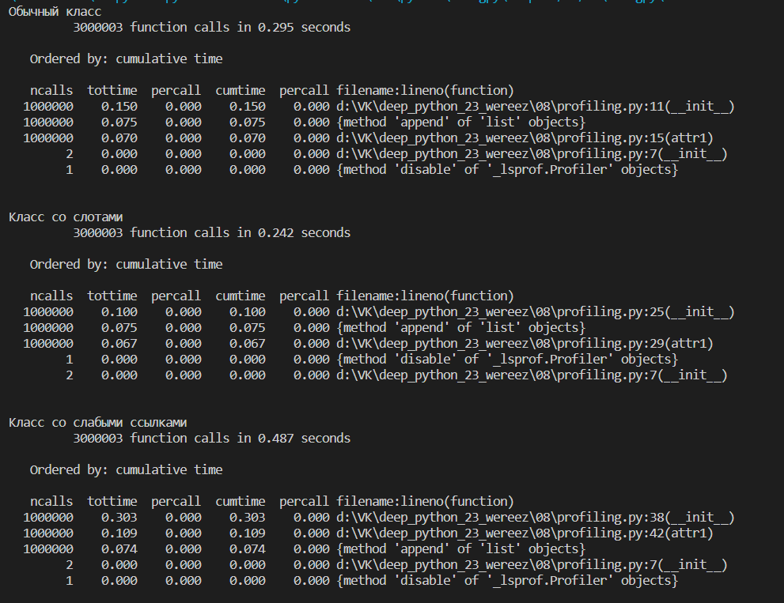
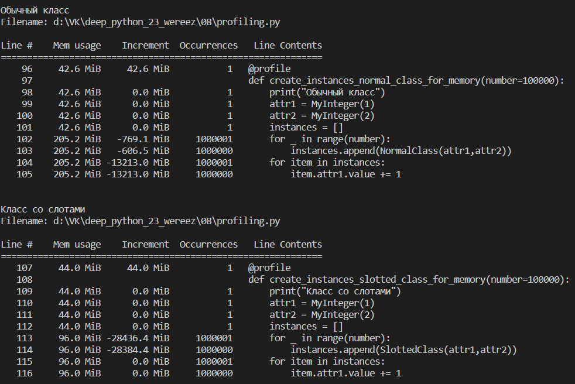
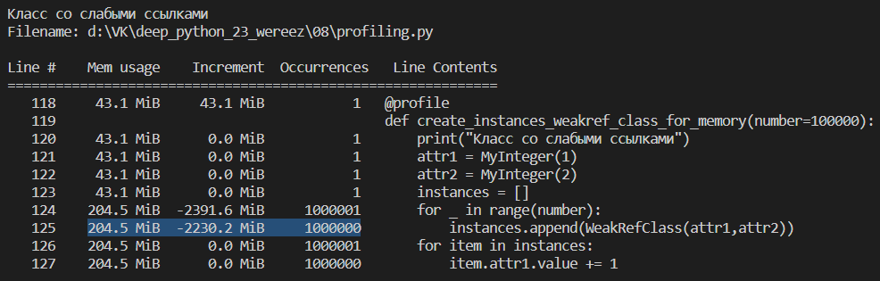

# Анализ домашнее задание #08 (память, профилирование)

## Профилирование по времени
Заметим, что класс со слотами быстрее всех создает пачку экземпляров и незначительно быстрее изменяет значение атрибутов. Это происходит, потому что в нем оптимизирован доступ к атрибутам объекта. Обычный класс и класс со слотами значительно быстрее создают объекты по сравнению с классом со слабыми ссылками, посколько не используют дополнительные механизмы.

## Профилирование по памяти
Класс со слабыми ссылками и класс с обычными атрибутами занимают примерно одинавый объём памяти, в то время как класс со слотами за счет отсутствия __dict__.

## Выводы
Класс со слотами наиболее быстрый и эффективный по памяти из перечисленных, однако стоит помнить, что не везде его можно использовать, потому что набор атрибутов фиксированный. Класс со слабыми ссылками бывает полезен, когда нам нужно хранить какие-то значения, не увеличивая счетчик ссылок.

